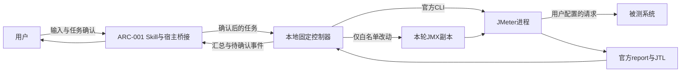
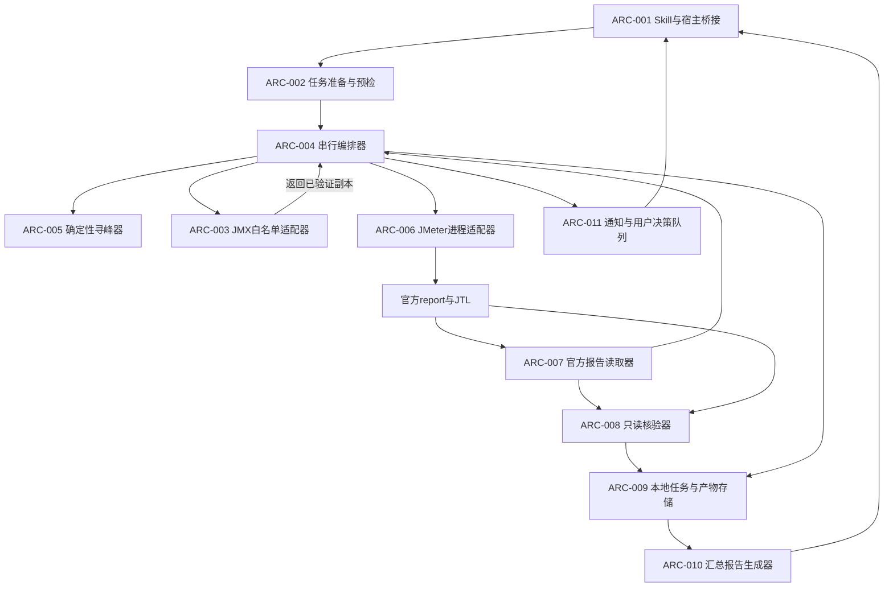
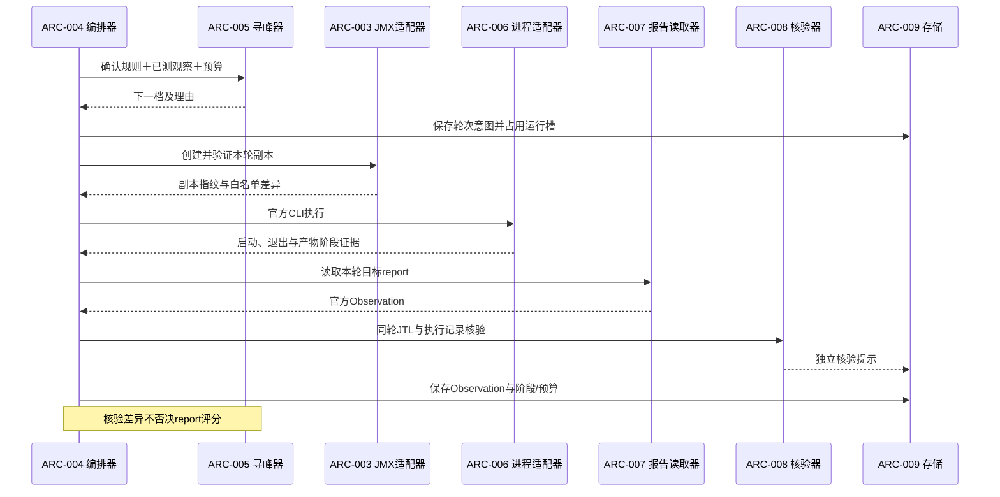

---
artifact:
  id: ART-JM-ARCH-001
  type: architecture
  title: jmeter-tps-runner architecture
  version: v1.3
  supersedes: v1.2
  statusCode: review
  statusLabelZh: 待评审
  reviewStatus: Codex内容核对完成；非新增用户需求批准或RC
  owner: Codex
  upstreamArtifacts: [jmeter-tps-runner-requirement-anchor-v1.2]
  downstreamArtifacts: [jmeter-tps-runner-release]
  createdAt: 2026-09-20
  updatedAt: 2026-09-20
  sourceBaseline:
    sources: [baseline-manifest.json, evidence-index.json]
    fingerprint: 3a6ff756abdfbce1c34ec8f70d808d50366a893a9a422677e5e0eb51187441f3
  riskAccepted: [RISK-001, RISK-002]
  openQuestions: []
  rtmRef: coverage-v1.1.json
---

# jmeter-tps-runner 架构设计 v1.3

## 1. 设计边界与基线

Skill名称为 **jmeter-tps-runner**。本版依据最终源码和已存在的执行证据回顾；仅更新事实、实现边界及追踪，不改变已批准的FR/BR/NFR/AC。历史基线只读保留。文档发布不将历史批准自动转移到新版本，亦不产生RC。

需求语义仍来源于已批准v1.2锚点；本次整理后的需求见[PRD v1.3](prd-v1.3.md)。原始设计/锚点SHA见baseline-manifest.json。实际模块、目录与资格在本版明确，旧文档不覆盖。

**架构结论：一个Skill交互入口、一个本地固定控制器、一个JMeter官方CLI适配器，使用本地文件保存任务和结果；不需要服务端、数据库、优化算法库或每轮模型调用。**

设计继承四条核心约束：

1. 固定程序只改JMX线程组并发和HTTP请求enabled；其余参数由用户配置。
2. 每个HTTP请求最多6轮、粗测最多4轮；细测围绕最佳合格候选取两侧中点并向下对齐10。
3. 官方report始终是评分来源，JTL核验差异只提示；正常结果不复测。
4. 输出已测最高合格TPS及完整轮次报告，不承诺全局最优或已撤回的精度。

本文件描述架构及已实现的边界。可执行Skill见../../skills/jmeter-tps-runner/，任务和测试结论分别在本目录开发/测试计划。

## 2. 架构驱动与技术方向

| 驱动 | 必须满足的行为 | 架构回应 |
| --- | --- | --- |
| 低人工重复 | 配置确认后自动连续压测 | 单进程串行编排，由结果事件推进，不按固定3分钟计时启动下一轮。 |
| 修改范围可审计 | 白名单之外的JMX配置不变 | 独立JMX适配器生成副本，另做语义差异审核；执行器只接受已验证副本。 |
| 预算确定 | 不超过6轮、粗测最多4轮 | 预算由编排器唯一持有；寻峰器只能提出候选，不能自行发压。 |
| 报告权威 | 不因核验差异偷偷换统计源 | report读取、质量判定、JTL核验分别建模，核验输出无改写或取消候选权限。 |
| 行为可回放 | 每次选点均可解释 | 纯数值策略与进程/文件I/O分离，输入规则版本、已测观察和输出理由持久化。 |
| Windows本地使用 | 中文路径、官方bat入口、宿主弹窗 | 专用进程/通知适配器，能力未通过资格验证时不声称支持。 |

已验证实现使用Python3.11标准库、现有Java17及JMeter5.6.3。控制器不引入SciPy、Taurus或服务端。其他版本和插件没有自动资格；以本次环境证据与明确支持边界为准。

官方资料支持CLI接口、报告语义和Python基础能力，不证明本产品的中点算法或参数最优。[JMeter CLI](https://jmeter.apache.org/usermanual/get-started.html)、[Dashboard](https://jmeter.apache.org/usermanual/generating-dashboard.html)、[Python subprocess](https://docs.python.org/3.11/library/subprocess.html)。

## 3. 系统边界与C4视图

### 3.1 上下文视图



被测系统地址、账号、业务数据都来自用户现有配置；本架构不引入新的业务接口。外部公开检索只用于开发设计，不进入运行循环，也不接收JMX、JTL或响应正文。

### 3.2 容器/模块视图



这是一个本地应用的逻辑模块图。ARC-002至ARC-010默认在同一Python控制器中运行，不拆成微服务；通知展示可由独立宿主桥接承接，使问题窗口不阻塞压测队列。图中核验器没有到寻峰器的否决通道。

## 4. 组件职责与信任边界

| 组件ID | 职责与所拥有的数据 | 禁止越权 |
| --- | --- | --- |
| ARC-001 | Skill说明、用户任务确认、调用固定程序、展示结果；拥有宿主交互上下文 | 不直接编辑JMX、不生成临时修补脚本、不逐轮替代寻峰器计算。 |
| ARC-002 | 只读解析输入、目标身份、依赖、运行环境和路径；生成待确认TaskSpec | 不执行请求；没有权限自行修正业务参数、插件、线程组enabled。 |
| ARC-003 | 创建运行副本，生成全部HTTP enabled映射：启用集合恰为当前目标及其确认前置，其余HTTP禁用；校验并发、集合及差异 | 不改线程组/控制器enabled、请求名、URL或其他属性；原JMX不变。 |
| ARC-004 | 唯一调度者；拥有目标队列、全局活动进程槽和分目标预算/阶段 | 不读JTL重算评分；不能跳过副本校验或通过模型决策增加预算。 |
| ARC-005 | 从固定TaskSpec与已测观察计算下一档/阶段/结束原因 | 纯函数边界，不启动进程、不写JMX、不访问模型或网络。 |
| ARC-006 | 官方CLI参数、启动/等待/退出记录、stdout/stderr及运行阶段状态 | 不修改脚本、不采用结果覆盖/删除参数、不自主重试发压。 |
| ARC-007 | 匹配实际版本，读取目标Statistics和官方起止时间，输出Observation | 不推测P90字段、不以Total/别的轮次补缺，不把进程时间当官方时间。 |
| ARC-008 | 对照同轮report/JTL/执行记录，输出一致、差异、疑点或不可比提示 | 无权替换Observation、排除候选、增加轮次或中断队列。 |
| ARC-009 | TaskSpec、事件、轮次、进程身份、指纹、文件映射与本地结果索引 | 不把自报完成变成运行证明，不覆盖历史产物，不自动恢复未知在途运行。 |
| ARC-010 | 生成Markdown汇总和便于机器读取的汇总JSON，引用官方指标与产物 | 不排序隐藏实际轮序、不合并同并发不同轮次、不虚构无数据值。 |
| ARC-011 | 将需要用户处理的问题持久化并向宿主发通知，关联异步答复 | 不阻塞后续目标；用户答复不能静默扩大当前冻结任务或自动重发。 |

修改白名单是固定程序的受控行为约束，不是操作系统沙箱。JMX本身可能含用户脚本和其他采样器；预检需要指出影响逐请求独立性或执行权限的节点，不能声称白名单使任何任意JMX都安全或必然独立。遇到无法在现有白名单内实现隔离的输入，交用户修订，不能偷偷关闭非HTTP节点。

## 5. 输入、接口与数据所有权

### 5.1 核心对象

| 对象 | 关键字段语义 | 所有者 |
| --- | --- | --- |
| TaskSpec | taskId、目标队列、原始输入指纹、依赖集合、并发范围和起始值、质量阈值、预设并发档位、TPS下降停止阈值、预算、输出位置、版本/适配器标识、用户确认依据 | ARC-002提出，ARC-001确认，ARC-004冻结使用 |
| TargetIdentity | 输入指纹+结构位置+线程组身份；显示名称、目录名、Statistics标签分开 | ARC-002 |
| RunIntent | task/target/round/phase、并发、选点原因、父候选与端点、剩余预算 | ARC-004 |
| PreparedRun | 原始及副本指纹、白名单差异、依赖路径检查、唯一产物路径、确认摘要 | ARC-003 |
| ExecutionResult | 真实启动证据、进程身份、退出状态、发压/报告阶段、实际产物位置；进程时间仅供审计 | ARC-006 |
| Observation | 目标身份、官方数值及原单位、P90语义、官方起止时间、来源字段、可读性和质量结论 | ARC-007/004 |
| AuditFinding | 同口径范围、检查项目、差异或疑点、证据入口；与Observation分开保存 | ARC-008 |
| SearchDecision | 下一档或结束、粗/细阶段、中心与端点、规则版本、理由、预算使用依据 | ARC-005 |
| UserQuestion | target/round、超标指标/门槛、report入口、未阻塞队列状态、用户答复记录 | ARC-011 |

上述为逻辑对象，不承诺同名JSON Schema。实际使用contracts.py的数据类及controller.py中的任务字典，映射见第16节。对象通过本地调用和文件传递；无自建HTTP API、数据库表或远程服务需求。

### 5.2 三个状态维度

每条Observation必须分开表示：

- `readability`：能否从正确目标、正确轮次的report读取所需指标。
- `quality`：按report数据满足门槛、超标或尚不能判定。
- `audit`：一致、发现差异、有疑点或不可比。

`audit=差异`且report可读取时，仍允许按`quality`进入候选和调参。`readability=无法读取`不能通过“以report为准”制造数值。这不是新增P90缺失专项重试机制：只将无法形成输入的事实反馈给宿主，不自动发压补数据。

### 5.3 接口目录

| 接口ID | 方向/调用者→所有者 | 输入→输出 | 副作用与失败语义 |
| --- | --- | --- | --- |
| IF-001 | ARC-001→ARC-002 | 明确输入和候选配置→TaskSpec/待补项 | 只读检查；身份或配置不兼容时未就绪，不执行JMeter。 |
| IF-002 | ARC-001→ARC-004 | 确认后的TaskSpec及指纹→任务接收结果 | 冻结配置并取得单运行槽；确认依据或指纹不匹配不启动。 |
| IF-003 | ARC-004→ARC-005 | 规则、已测观察、阶段与剩余预算→SearchDecision | 无外部副作用；无法生成合法新点返回原因，不自动凑点。 |
| IF-004 | ARC-004→ARC-003 | RunIntent、原始JMX、目标及确认前置集合→PreparedRun及完整HTTP映射 | 校验实际启用集合与目标加前置集合相等；越界差异或无关HTTP仍启用则拒绝当前副本。 |
| IF-005 | ARC-004→ARC-006 | PreparedRun、现有JMeter入口→ExecutionResult | 真正发压边界；启动失败与已启动后失败区别记录，不自动重发。 |
| IF-006 | ARC-004→ARC-007 | 唯一report路径、版本及目标映射→Observation | 只读；无法唯一识别、缺字段或无产物时返回明确不可读状态。 |
| IF-007 | ARC-004→ARC-008 | Observation、同轮JTL、执行证据→AuditFinding | 只读；口径不匹配标不可比，不替换官方数据、不触发额外轮次。 |
| IF-008 | ARC-004/各组件→ARC-009 | 事件和产物索引→落盘确认 | 顺序写入；持久化失败后不再安排新发压，避免失去计数与归属。 |
| IF-009 | ARC-004→ARC-011→ARC-001 | UserQuestion→投递/展示/答复状态 | 主队列继续；“写入队列”不冒充“弹窗已显示”。 |
| IF-010 | ARC-004→ARC-010 | 全目标轮次和结束状态→汇总Markdown/JSON | 只生成新文件；汇总失败可重新渲染，不重新发压。 |

接口中的任务确认只是当前任务配置和动作范围的绑定，不是密码学身份认证。不要给哈希或确认字段赋予它们没有的系统隔离能力。

## 6. JMX修改与兼容性设计

### 6.1 修改链路

原始JMX只读并计算指纹 → 解析全部HTTP请求/线程组结构 → 确定当前目标及确认前置集合 → 仅对该集合启用HTTP，其余HTTP全部禁用，同时修改目标线程组并发 → 写运行副本 → 独立检查完整enabled集合和语义差异白名单 → 绑定指纹后允许执行。

目标切换不只更换评分标签：必须等待当前轮进程和报告阶段结束，再基于下一目标重算集合。上一目标若非下一目标确认前置则禁用，若是则仅作为依赖保留。搜索按既定预算和停止规则结束，不以找到合格峰值作为继续队列的必要条件。无法仅通过允许的HTTP enabled实现隔离时预检提示用户处理，不改非HTTP节点。

差异白名单精确到元素身份和属性/文本位置，不能只比较“文件可解析”。属性顺序或序列化格式变化不能掩盖脚本正文、CSV路径、断言、用户变量、控制器结构变化。必须保留有意义文本、注释和处理指令；无法保真的结构不支持直接运行。

Python官方说明默认ElementTree解析会省略注释、处理指令和文档类型声明。最终使用标准库minidom保留注释/处理指令，Expat预检拒绝含DTD的输入（含UTF-16），并以独立树遍历做语义差异检查；即**显式XML适配器＋独立语义差异检查**，而不是默认解析后直接覆盖。首期不承诺DTD/外部实体及任意扩展结构支持；识别到不支持形式时在准备阶段报告。原始文件始终逐字节不变。[ElementTree官方说明](https://docs.python.org/3.11/library/xml.etree.elementtree.html)。

### 6.2 相对路径与运行副本

AQ-001原设计允许同目录优先或经验证的独立布局。当前Store固定在输出目录的plans子目录创建运行副本，进程cwd为该副本目录。预检发现相对文件因搬移而改变上下文时阻塞，不复制依赖、不改JMX路径。自动同目录布局选择尚未提供，这是当前适配限制，不能读成原设计已全部实现。

原件只读；副本可能含敏感配置，只留在用户确认的任务位置。无相对依赖的已授权输入已实测。

### 6.3 支持范围与适配器边界

AQ-006已确认首期适配范围为标准JMeter线程组中可明确定位的整数字面并发，以及可单独识别的HTTP Sampler。并发由函数/属性表达式、插件线程组或复杂数据驱动策略决定时，先标明无法按当前固定规则可靠修改；不能擅自把表达式替换成常量或通过其他参数绕过限制。

不同线程组可能有同名请求，但目录唯一不等于report统计唯一。准备阶段必须证明当前启用集合和report映射能唯一指向目标。若目标与前置请求同标签导致统计合并，或存在额外不能关闭的活动非HTTP采样器，不通过重命名/关闭父节点来解决；提示用户整理输入。未激活分支和依赖结构仍需保留。

版本支持采取“明确版本＋能力画像＋验证样本”策略，不承诺所有JMeter版本通用。TQ-001已限定验证JMeter5.6.3标准结构；插件及其他版本未获资格。

## 7. 执行、状态与数据流

### 7.1 单轮序列



CLI保持`jmeter -n -t <副本> -l <JTL> -e -o <report>`的官方语义。可为诊断使用官方日志输出能力，但不得用额外属性覆盖时长、业务参数或其他禁改字段；不使用`-f`删除既有结果，不注入`-J`等改变用户配置。report目录每轮唯一。[官方CLI选项](https://jmeter.apache.org/usermanual/get-started.html)。

Windows `.bat/.cmd` 可能经系统shell解释，不能把`subprocess`参数列表或`shell=False`视为所有特殊字符都已处理。ARC-006隔离完整入口、固定允许参数和路径转义；路径包含不支持字符时在发压前报告，不能拼接未经验证的自由命令。中文、空格和shell元字符参数需专项资格验证TQ-002，进程stdout/stderr持续写本地文件，避免未消费管道阻塞。[Python进程与Windows批处理说明](https://docs.python.org/3.11/library/subprocess.html)。

### 7.2 任务状态

`待准备 → 待用户确认 → 已就绪 → 当前目标粗测 → 当前目标细测 → 当前目标结束 → 下一目标 → 汇总完成`。

单轮子状态为`已计划 → 副本已验证 → 已启动 → 发压结束/报告处理中 → 产物可读或异常 → 已记录`。只有明确已启动发压的轮次占用实际6轮预算；启动前预检失败不算已发压，但预留的轮号保留审计。

预算及已测集合由ARC-004唯一写入。实际启动到记录之间不能获得跨进程绝对“恰好一次”保证；控制器异常后若是否发压不明，保存`in-flight-unknown`，禁止自动重放，交人工确认。此为不重复发压的最小语义，不增加通用断点恢复功能。

### 7.3 性能结果与技术失败的分流

| 事件 | 当前请求 | 后续队列 |
| --- | --- | --- |
| 首轮质量超标，无合格点 | 结束该请求，保存report，投递问题，不下探 | 按确认规则继续后续目标；无需等待用户答复。 |
| 已有合格点后超标 | 完成本轮，限制更高并发，进入/继续允许的细测 | 当前请求按搜索规则结束后继续。 |
| 可读取report但核验不一致 | 记录提示，仍依report评分/选点 | 正常继续。 |
| report不可读或无法唯一识别 | 标记当前请求技术问题，不生成臆造Observation、不自动重发 | 设计选择：若进程已明确结束且问题仅属于该目标，记录并继续下一目标；共享配置/存储故障则不启动新轮。 |
| 进程仍活跃或状态未知 | 不释放活动进程槽，不自动恢复发压 | 等待明确结束/用户处理，不能与下一目标重叠。 |
| 用户要求停止 | 停止安排新轮，明确当前轮是否还活跃 | 不启动后续目标；当前进程控制行为由独立适配器落实。 |

未配置自动的“3分钟超时杀进程”，也不因暂时无输出认定失败。原JMX时长和JMeter真实结束语义不同，报告生成还可能额外耗时。技术故障处理不变相恢复正常峰值复测。

## 8. 确定性寻峰设计与OQ收敛

本节按CQ-001及AQ-004/005执行预设档位、侧序和并列规则；预算、质量门槛和中点规则不变。初始值仍按每任务确认；纯规则、边界反例及真实决策回放已验证。

### 8.1 共同约束

- 候选域为用户确认范围内可用的10倍数并发值；不越界。
- 初始并发先读取原配置作为候选。非10倍数时展示不兼容原因及对齐候选，由用户在本次任务确认初始值；不能自动修改其原始JMX或静默把47变成40。
- 原设计允许非10倍数上下界映射到有效网格；当前controller.validate_config要求上下限也为10的正整数倍，不会自动对齐。此输入便利能力未实现；本次已确认50～500在支持范围内，不能宣称任意边界已验证。
- 质量只看官方report；每轮保留原始精度，展示舍入不参与排序。错误率输入0.5%作为0.005比例比较，P90统一毫秒。

### 8.2 粗测

1. 按确认绝对并发档位50→100→200→500顺序执行，取消增量步长和三项升级阈值。
2. 当前轮质量失败优先执行原质量停止规则；首轮失败不转细测，结束本目标并继续后续目标。
3. 相邻粗测官方目标TPS按原始可读精度计算 `(上一TPS－当前TPS)/上一TPS`，下降≥0.03即结束粗测，转入最佳合格候选附近细测。上一TPS=0时不计算比例、不视为触发，不增加专项复测。
4. TPS下降但合格的当前轮保留候选资格；此条件不产生质量失败上界。细测仅遵守原有质量边界，不把3%条件扩展为细测停止规则。
5. 达到4轮或档位用尽也转细测，总发压最多6轮。不能通过增量截断、自动跳档或追加1000改变确认的粗测序列；范围外档位在任务准备时解决。
6. 下降停止是用户的时间/探索取舍，不是报告损坏或全局最优的证明。

### 8.3 细测

中心B为已测最高合格TPS对应并发；TPS精确并列时，**较低并发优先作为搜索中心**，同时报告保留全部并列峰值事实。若并发也相同，使用原有效轮次，不能为打破并列重测。

以B左右最近已测档位作为端点，首组自然为相邻粗测点；缺失侧用确认边界。每侧取`10 × floor((B+端点)/20)`，分别筛掉范围外、已测或与中心重合的候选。先生成同一中心的左右一组，**先左后右**；预算仅剩1轮时取该组第一个合法点。选择左侧优先是稳定且偏向较低负载的工程取舍，不是“左侧一定更优”的证据。

两侧完成前不因第一侧TPS变化重新移动中心。每次发压前仍重新检查预算和质量失败上界，若第一侧产生更低的质量失败边界，原计划右侧已超该边界则跳过；这保证既定停止规则优先于“测完两侧”。分组结束后，以全部已测结果更新B和最近邻点，继续下一组。

已观测质量失败点中的最低并发作为后续不可向上跨越的边界；已测失败点可作为几何端点帮助缩小区间，但不能成为合格中心。即使更高并发曾有合格记录，也不据此自动解除这个后续发压边界；历史合格观测仍保留参与最终排名。上侧没有新点则只做左侧，不向其他局部区域重新扩搜。全部新点耗尽或预算到6即结束。

### 8.4 六轮示例（仅演示，不是性能数据）

范围50～500且前四轮均合格、未发生相邻TPS下降≥3%时，粗测并发为50、100、200、500。假设200为最佳，左右相邻100与500，则同组细测为150、350，先左后右，总计6轮。

提前结束示例：100并发TPS1000、200并发TPS970，则不再粗测500，按已有最佳合格点进入细测。200轮若合格仍保留；这不证明500必然更差。

### 8.5 PRD待定项处理结果

| 原待定项 | 架构选择 | 当前证据 |
| --- | --- | --- |
| OQ-001 侧序/并列 | 左后右固定顺序；剩1轮先左；相同TPS较低并发作中心、报告保留并列 | DEV-E01/03/05已验证同输入同结果、预算和失败边界优先。 |
| OQ-002 档位/边界/零TPS | CQ-001取代增量截断；确认范围内预设档位，零TPS不算下降率 | DEV-E01/03已验证档位序列、3%边界、零TPS、预算回放。 |
| OQ-003 版本/身份/宿主 | 版本化适配器与能力预检；不支持时提示；通知投递与展示分别留证据 | TQ-001至TQ-004已取得限定范围证据，见第13节。 |

OQ-001的侧序和并列规则由AQ-004/005确认；OQ-002的增量末步语义由CQ-001取代；OQ-003的首期范围及交互通道由AQ-002/006确认。本次环境资格已验证，结论及限制见第13节；历史用户原话与旧文档保持。

## 9. 官方报告、核验与存储

### 9.1 读取器

使用对应report的统计数据文件读取目标行，并绑定配置中的真实百分位含义；官方默认百分位90/95/99可被用户改动，不能仅按`pct1`位置断言P90。Start Time/End Time从该版本report用于页面展示的信息读取，保留显示语义，禁止由进程记录或JTL重算替代。[官方报告配置](https://jmeter.apache.org/usermanual/generating-dashboard.html)。

读取器输出应包含源字段/文件和报告版本，不只返回一组失去来源的数字。无法确认目标、轮次、百分位或单位时给出不可读/不可确认状态；不偷偷选择Total或回退到另一个报告。

### 9.2 核验器

先核对任务/目标/轮次和统计口径，再比对样本数、失败数/错误率、单位及时间合理性。精确计数逐值比对。实际report.py对JSON与dashboard的错误率表示差异使用0.000001个百分点容差；内部错误比例一致性提示阈值为0.01个百分点。这两个阈值仅控制提示，不修改官方数值、质量门槛、评分或轮次；它们不构成通用误差正确性保证。百分位不能忽略报告算法/窗口差异拿自算值强行判错。核验的目标是指出有证据的差异，不能证明响应业务正确或原始采样绝对可信。

核验结果与观察记录是并列数据，摘要报告即使发现疑点也保留实际官方数值和提示。仅趋势突变既不能自动归因，也不能触发复测。官方数值自身未达到质量门槛时，仍按质量失败处理；这与“核验差异不排除”并不矛盾。

### 9.3 本地产物布局

```text
<本任务输出根目录>/
  task.json
  events.jsonl
  snapshot.json
  progress.json
  execution.lock             # 正常结束移除；异常保留
  questions/<question-id>.json
  summary.md
  summary.json
  <HTTP名称清理值--身份哈希后缀>/
    <并发数>/
      plans/run-001.jmx
      report/run-001/
      result/result<并发数>-run-001.jtl
      result/result<并发数>-run-001.round.json
      result/jmeter-run-001.log
      result/console-run-001.txt
```

实际映射保存在目标、轮次与paths记录中；没有独立target-map.json或questions.jsonl。标准输出和错误流合并到console文件。

目录名对非法字符和碰撞做稳定映射；内部请求身份不依赖目录名。已有轮次文件只读保留，新轮次使用独立路径。元数据通过临时文件写完整后替换，事件由单写者追加；这些机制不等于跨文件事务或断电恢复保证。任务状态不提供自动恢复未知发压的入口。

汇总保留PRD规定的六列和实际轮序，按请求分节标记最高合格TPS、观测最高TPS、预算和结束原因。Machine JSON方便后续回放，不取代用户指定的Markdown格式。

## 10. 通知、部署边界与演进

### 10.1 非阻塞问题窗口

首轮不合格时，ARC-004先保存事实并结束当前请求，再向ARC-011投递问题，随后继续目标队列。ARC-011的持久问题包含接口名、质量超标和继续说明；并发、指标/门槛及report入口保存在轮次记录和任务配置，宿主展示时应关联这些证据。当前卡片title不会自动嵌入全部指标与链接，不能宣称该展示细节已自动实现。独立窗口不得让后台控制器等待`ShowDialog`或模型答复。

AQ-002确认首期优先使用当前AI宿主内的异步问题卡片；固定控制器只输出问题事件，由宿主适配器投递，后台不等待用户答复。独立Windows窗口不作为首期默认方案。当前Codex真实问题卡提交及用户答复已有证据，首个卡片提交时后续目标继续运行。宿主需读取questions并调用异步工具；没有常驻自动通知服务。其他宿主仍需验证。不能把文件落盘称为已通知，也不能静默降级为日志。普通轮次不要求模型逐轮确认。

用户答复记录到对应问题。用户要求补测/重试时作为新的明确任务或受控变更处理，不塞回当前冻结队列突破6轮。

### 10.2 已交付Skill结构

```text
jmeter-tps-runner/
  SKILL.md
  scripts/       # 固定入口及控制器模块
  references/    # 配置、支持范围、字段映射和结果解释
  agents/openai.yaml
  tests/         # 合成离线测试；无用户JMX
```

这是当前可执行包的结构。Skill正文描述触发、准备、任务确认和如何调用固定入口；算法、白名单和持久化约束由固定程序实现。运行时不在任务目录生成新的修改算法，也不要求把当前用户路径写死进Skill。

不安装数据库或常驻服务。适配器接口保留以后增加线程组类型、平台和报告版本的空间，每个扩展需单独资格；扩展不能覆盖原已确认权限或把旧任务无声迁移。

## 11. 架构决策记录（ADR）

| 决策ID | 上下文与选项 | 当前选择 | 取舍与后果 |
| --- | --- | --- | --- |
| ADR-001 | 每轮AI决策、Taurus编排或固定本地控制器 | 固定本地Python控制器＋官方CLI | 可重复、低模型依赖；需要自行实现有限寻峰逻辑，标准库是复用基础。 |
| ADR-002 | 修改原JMX、任意参数覆盖或白名单副本 | 原件只读，精确白名单副本及独立差异校验 | 增加副本和指纹成本，换取可审计边界；不支持的结构先报告。 |
| ADR-003 | report与JTL重算择优、发现差异停测或report优先 | 官方Observation和AuditFinding分离，report优先 | 遵从Q-031；风险随报告偏差传播，必须保留提示。 |
| ADR-004 | 全区间扫描、通用数值优化库或已确认规则 | 最多4轮粗测＋预算内两侧中点细测 | 可控时间；不提供全局最优或精度保证。 |
| ADR-005 | 左优先、右优先、随机或模型选侧 | 左后右；相同TPS较低并发中心 | 确定、较低负载优先；可能遗漏只剩一轮时右侧更优值，结果不保证全局最优。 |
| ADR-006 | 旧增量截断与用户纠正的绝对档位冲突 | CQ-001取代旧语义：确认范围内预设档位按序执行，下降≥3%转细测 | 不追加或截断生成新粗测档位；保留非10起点确认规则。 |
| ADR-007 | 弹窗阻塞、宿主问题卡或独立Windows窗口 | AQ-002确认持久问题事件＋当前AI宿主异步问题卡 | 后台继续后续目标；当前Codex桥接证据见TQ-004，其他宿主另验，不把日志冒充通知。 |
| ADR-008 | 数据库/服务、内存或本地文件 | 单写者JSON/JSONL＋官方原文件 | 依赖少、易查看；不具备事务恢复和跨机器协调，不宣称支持自动断点续跑。 |
| ADR-009 | 任意线程组直接兼容或分期适配 | AQ-006确认首期标准线程组＋整数字面并发 | 表达式和插件先预检提示，不自动替换表达式或安装插件；具体版本资格另行验证。 |
| ADR-010 | 原目录副本或独立任务目录 | AQ-001确认同目录优先但不强制，其他位置须保持并验证依赖 | 原件不变，任务前确认可写位置；不改禁改路径参数来迁就目录。 |

上述ADR已纳入本轮架构评审；AQ-001至AQ-007及整体关闭记录为确认依据。它们不是官方最优算法推荐，也不代表真实压测已通过。

## 12. 需求与验收追踪

| PRD需求 | 主要架构机制 | 对应验收 |
| --- | --- | --- |
| FR-001 | ARC-001、ARC-002、IF-001 | AC-001 |
| FR-002 | ARC-002、ADR-009 | AC-025 |
| FR-003 | ARC-001、ARC-002、IF-002 | AC-004 |
| FR-004 | ARC-002、ARC-003、ADR-002 | AC-003 |
| FR-005 | ARC-003、IF-004、ADR-002 | AC-002 |
| FR-006 | ARC-004、ARC-006、IF-005 | AC-005 |
| FR-007 | ARC-009、ADR-008 | AC-006 |
| FR-008 | ARC-007、IF-006 | AC-007、AC-008 |
| FR-009 | ARC-004、IF-002 | AC-009 |
| FR-010 | ARC-005、ADR-004、ADR-006 | AC-010、AC-011、AC-012 |
| FR-011 | ARC-005、ADR-005 | AC-015、AC-016、AC-017 |
| FR-012 | ARC-004、ARC-005、ADR-004 | AC-012、AC-018、AC-023 |
| FR-013 | ARC-004、ARC-011、IF-009 | AC-013、AC-014 |
| FR-014 | ARC-008、IF-007、ADR-003 | AC-019、AC-020 |
| FR-015 | ARC-005、ARC-007、ARC-010 | AC-021 |
| FR-016 | ARC-010、IF-010 | AC-022 |
| FR-017 | ARC-009、IF-008 | AC-002、AC-019、AC-024、AC-026 |
| FR-018 | ARC-001、ARC-004、ARC-005、ADR-001 | AC-024 |

| PRD非功能需求 | 场景与机制 | 验证方式（架构约束，非完整测试计划） |
| --- | --- | --- |
| NFR-001 | 非白名单变更时ARC-003拒绝PreparedRun；原件指纹不变 | AC-002：合法改动与禁改字段反例、带注释/脚本文本输入。 |
| NFR-002 | 相同TaskSpec与观察输入经ARC-005得到相同候选与原因 | AC-024：离线回放边界、侧序、并列、零TPS输入；不发真实请求。 |
| NFR-003 | 每个展示值来自明确report字段，核验不覆盖它 | AC-007、AC-008、AC-019：不同百分位配置和不一致样本对照。 |
| NFR-004 | ARC-004唯一运行槽及预算写者，ARC-006等待真实结束 | AC-005、AC-012、AC-018：进程模拟/隔离资格，计数和无重复发压证据。 |
| NFR-005 | RunIntent→副本→执行→Observation→决策→汇总可逐项关联 | AC-022、AC-024：从汇总反查源report和规则版本。 |
| NFR-006 | 路径/版本预检、固定进程适配和本地保存 | AC-006、AC-025：中文空格/特殊路径、缺依赖时不安装、不外发。 |

PRD全部26条AC已映射；AC-003/009按AQ-007补齐完整HTTP启用集合、A切B且A是否为B前置两种分支及无关C禁用的验收；AC-026额外覆盖不可读、身份冲突和未知在途状态。详细实施、用例和已有证据见本目录开发计划、测试计划、coverage-v1.1.json与验收矩阵。映射存在本身仍不等于通过。

## 13. 风险与技术资格

| 编号 | 事实、风险或待验证项 | 处理及完成证据 |
| --- | --- | --- |
| RISK-001 | 有限局部搜索可能遗漏更高TPS，正常不复测受噪声影响 | 沿用用户接受的预算/结果边界，验证已测合格集合最大值选择准确。 |
| RISK-002 | report即使有核验差异仍被使用 | 依用户决定保留提示；不谎称数据一致或评分无风险。 |
| TQ-001 | 版本、标准线程组、依赖及report字段 | 已通过当前5.6.3与已授权输入；真实6轮、版本探针、report逐字段核对；其他版本/插件/相对依赖搬移未验证。 |
| TQ-002 | Windows参数及进程生命周期 | 实际批处理argv探针和串行等待通过；中文、空格、&、括号已验；引号、%、!、换行等拒绝。 |
| TQ-003 | XML保真与结构隔离 | minidom/Expat、注释/PI、UTF-16 DTD拒绝、完整enabled集合、独立越界突变及六轮副本检查通过；不支持任意XML扩展。 |
| TQ-004 | 当前宿主异步问题与后台继续 | 原生异步工具接受、后续目标继续、实际用户答复已有证据；并非后台Python直接调用宿主工具。 |

旧technical-qualifications.json将TQ-003错误描述为报告适配；本版纠正为原架构的XML保真，报告证据归TQ-001。旧记录保持，仅由technical-qualifications-v1.1.json及本版结论替代其当前入口。

本次不新增未经证据证明的低概率异常防护。技术资格来自正常执行边界和官方已知行为，不推断其发生率。失败点、格式不兼容与宿主能力的处理只负责防止伪造数据和未经确认扩权。

## 14. 来源、复用与后续边界

本轮沿用用户选择的Codex检索。官方正文已读取并记录在`research-receipt.json`，覆盖审查见`research-review.json`与`architecture.json`状态文件。检索已完成；实际运行资格与研究事实分别由本目录证据索引和下列历史来源支持，不混为一谈。

| 来源 | 本轮支持的设计事实 |
| --- | --- |
| [Python subprocess](https://docs.python.org/3.11/library/subprocess.html) | 进程生命周期/退出证据及Windows批处理参数解释需单独考虑。 |
| [Python ElementTree](https://docs.python.org/3.11/library/xml.etree.elementtree.html) | 默认XML解析不保留所有节点，需要显式保真与差异检查。 |
| [JMeter Dashboard](https://jmeter.apache.org/usermanual/generating-dashboard.html) | 报告百分位可配置，读取与核验需匹配口径。 |
| [JMeter CLI](https://jmeter.apache.org/usermanual/get-started.html) | 保持官方n/t/l/e/o接口，不引入会删除结果的参数。 |

复用优先采用现有JMeter和Python标准库。既有调研中的Taurus、DSL Skills和性能知识Skills没有经验证的完整匹配，当前无理由增加它们为运行依赖；许可和目标版本只在真正采用代码时核验。中点、预算、并列与侧序均为产品/工程选择，不借第三方资料证明最优。

**本次完成边界：**本版更新实现事实及资格状态，不重写旧需求或测试历史。当前发布仅Github，未全局安装或同步GitBook。有限搜索、report优先及本版输入限制持续适用。

## 15. 变更治理

CQ-001的绝对档位、取消升级阈值和3%相邻下降规则保持。新增适配、更广平台或展示能力须独立实现和验证，不能通过修改文档宣称已支持。详细差异见reconciliation-review.md。

## 16. 逻辑接口到最终代码

| 接口 | 最终实现 | 返回/持久化 |
| --- | --- | --- |
| IF-001/002 | runner prepare、preflight.preflight、controller.validate_config/run | 结构预览、阻塞项、冻结配置；prepare本身不是完整运行预检 |
| IF-003 | search.decide_next、contracts数据类 | SearchDecision；Decimal原始精度 |
| IF-004 | jmx.inspect_jmx/prepare_copy/verify_copy | 源/副本SHA、完整HTTP集合及树差异 |
| IF-005 | process.run_jmeter | Execution、真实PID/退出、合并console流；官方命令额外-j仅分离日志 |
| IF-006 | report.read_report | ReportMetrics；statistics.json、dashboard.js表头和index.html官方时间 |
| IF-007 | audit.audit_jtl | 计数与可比性；默认unknown，未验证过滤范围不称一致 |
| IF-008 | storage.Store/write_new/atomic_json | 独占锁、事件hash链及轮次路径；无自动恢复 |
| IF-009 | host.enqueue/acknowledge、runner questions/ack-question | queued→submitted-to-host→answered；提交不等于用户看过 |
| IF-010 | summary.render/peaks、runner render | 全实际轮次六列、合格峰值与观测最高；仅新文件重渲染 |

最终运行版本限定5.6.3英文report结构；P90以表头90th pct在三个百分位列的位置确定。缺失或身份不唯一抛出ReportError，不构造零值。核验未计算替代TPS/P90；过滤或聚合口径未获资格时标不可比。
