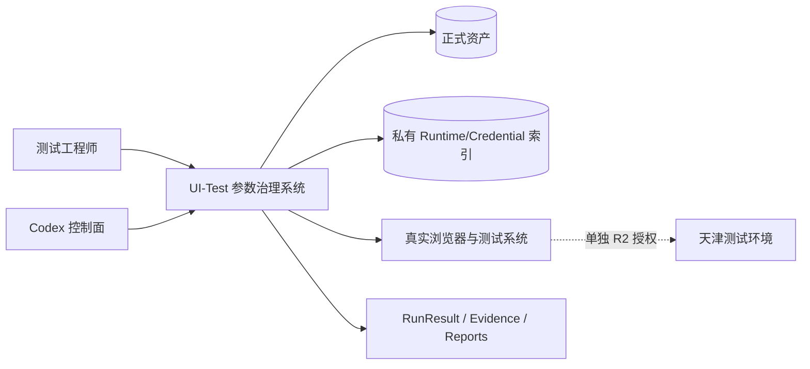
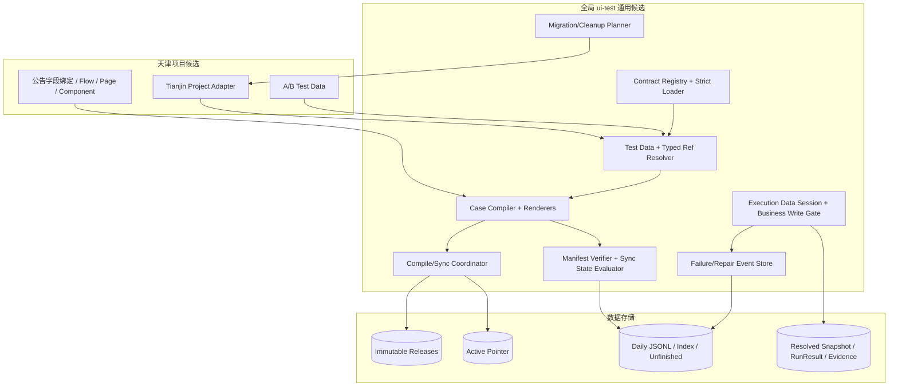

# UI-Test 参数治理、迁移与失败修复架构

状态：`approved-as-built / 已按落地实现复核`  
规范 Envelope：`envelopes/architecture-v0.4.envelope.json`  
需求锚点：`RA-UI-TEST-REPAIR-20260830@v0.7`  
说明：旧版本保持只读；本文件是当前后继版本，不回写历史文档。

## 1. 架构目标与边界

本架构提供一个确定性、可迁移、可恢复的 UI-Test 资产治理系统，覆盖：

- A/B 分支业务数据唯一来源；
- 类型安全 Runtime/Credential/Sequence 引用；
- Compiler 和全部 renderer 的统一参数身份；
- manifest-driven release 校验和 plan-bound 同步；
- Playwright 执行期只读快照、零写入门禁和运行实际参数快照；
- 产品级失败/修复事件、可重建投影和恢复；
- 旧格式正式资产迁移、execution eligibility 和非正式资产清理治理；
- 全局通用引擎与天津项目适配器物理分离。

真实 UI、R2/R3、全局安装、正式 D 盘写入、依赖安装和实际删除不属于本架构文档的自动执行范围。

## 2. 架构驱动因素

| 驱动因素 | 架构响应 |
|---|---|
| Test Data 唯一可编辑业务参数源 | Source Case 与 Test Data 双事实域；编译时合并为单一 build identity。 |
| 历史资产不可改写 | v1 审计读取、新写 v2、迁移生成后继 release。 |
| 参数和 Runtime 漂移 | JCS hash、受引用 Runtime digest、反向影响图和 input-sync evaluator。 |
| 多文件和并发写入 | 跨进程锁、计划/CAS、同目录 staging、原子替换、readback、恢复协议。 |
| 凭据隔离 | Credential Loader 单独拥有；参数清单和快照只保存引用。 |
| 产品级故障可定位 | JSONL 权威事件源、index/unfinished 投影、稳定问题指纹。 |
| 复用优先 | 扩展现有 ui-test 内核；第三方依赖必须许可证、版本/hash 和授权准入。 |

## 3. 事实域与数据所有权

```text
Source Case：测试意图 / 步骤 / 断言 / 风险 / 字段语义 / 依赖引用
Test Data：稳定业务参数值 / 生成规则 / typed runtime refs
Runtime Index：环境值 / 显式敏感性
Credential Index：账号密码，仅进程内存
Runtime State：跨运行序列
Resolved Test Data：某次 run 的实际参数与序列分配
```

构建事实为 Source Case、Test Data、依赖、配置、版本和“被引用且参与编译的 Runtime 摘要”的组合；任何单独投影都不是事实源。

## 4. C4 System Context



信任边界：私有索引值不得跨出受控进程；真实浏览器/R2 属独立风险门禁；正式 D 盘写入和清理删除均需精确授权。

## 5. C4 Container View



## 6. 组件目录

| ID | 组件 | 所有者 | 责任 |
|---|---|---|---|
| ARC-001 | ContractRegistry/StrictJsonLoader | global ui-test | Draft 2020-12、严格 UTF-8/重复键/非法数字检查和稳定错误。 |
| ARC-002 | TestData/TypedReferenceResolver | global ui-test | case/branch/hash、RFC 6901 参数引用、Runtime/Credential/Sequence 分类。 |
| ARC-003 | CaseCompiler/Renderers | global ui-test | 统一 build identity、CASE_PARAMETER_MANIFEST 和全部投影。 |
| ARC-004 | ManifestVerifier/SyncStateEvaluator | global ui-test | 完整附件集合、release integrity、input sync 和 execution gate。 |
| ARC-005 | CompileSyncCoordinator | global ui-test | dry-run/apply、计划绑定、CAS、staging、不可变发布和 active readback。 |
| ARC-006 | ExecutionDataSession/SnapshotWriter | global ui-test | 不可热加载快照、消费点校验、resolved snapshot 和首次业务写门禁。 |
| ARC-007 | FailureRepairEventStore | global ui-test | 权威 JSONL、投影、幂等、跨进程锁、恢复和 repair gate。 |
| ARC-008 | MigrationCleanupPlanner | global ui-test | inventory、兼容迁移、执行资格、清理 disposition、dry-run 和门禁。 |
| ARC-009 | TianjinProjectAdapter | Tianjin project | A/B 路径、字段绑定、定位器、私有引用和 diagnostics 路径。 |
| ARC-010 | RunResultEvidenceLinker | global ui-test | resolved snapshot、RunResult、evidence index 和报告身份一致性。 |

## 7. 核心动态流程

### 7.1 编译和同步

```text
严格加载 Source/Test Data/Runtime/依赖/config
→ Schema + 语义校验
→ RFC6901 参数解析
→ RFC8785 canonical hash
→ CASE_PARAMETER_MANIFEST
→ Case IR / Resolved IR / Human / Midscene / Playwright
→ compile receipt
→ manifest 枚举全部非自身附件
→ dry-run plan
→ apply 前重新读取并复算
→ case+branch 排他锁和 expected-active CAS
→ operation 唯一 staging
→ manifest-driven 验证
→ immutable release
→ 激活前第二次 CAS
→ active 原子替换和 readback
```

### 7.2 执行和运行快照

```text
读取 active build 和编译身份
→ Guard 启动校验并冻结 Test Data
→ 确认 diagnostics 可写/可验证
→ 创建独立 non-persistent BrowserContext
→ 每次参数消费前复算当前 hash
→ 生成并封存 resolved-test-data
→ 首次业务写前再次复算
→ 通过 BusinessWriteGate 后才能触发一次业务写
→ RunResult/evidence 同时记录 snapshot ref/hash
```

Guard、日志、快照或哈希失败时，业务写请求和提交动作均为零。

### 7.3 失败、修复和恢复

```text
获取产品级排他锁
→ 验证已有 JSONL / index / unfinished
→ 持久化事务意图
→ 追加一条完整事件并 flush/fsync
→ 原子替换 index 投影
→ 原子替换 unfinished 投影
→ readback/hash 验证
→ 清除事务意图
```

JSONL 是唯一权威历史；index 和 unfinished 可从历史重建。相同幂等键可恢复未完成投影；不同事件遇到 pending transaction 时 fail closed。普通 append 不得静默重建损坏索引。

### 7.4 迁移和清理

```text
冻结 D 盘 inventory
→ 分类 current-formal / historical / private-ref / tmp / backup / cache / IDE / governance
→ A/B current-formal 生成迁移计划和后继资产
→ workspace 验证
→ 单独授权后正式发布和 active 切换
→ 旧 release/run/report 永久只读
→ 非正式资产产生 retain / cleanup-eligible / hold / unresolved disposition
→ 单独删除授权前仅 dry-run
```

## 8. 状态模型

状态分为三个互不替代的轴：

| 轴 | 状态 | 权威来源 |
|---|---|---|
| `release_integrity` | `valid/manual_drift/invalid/missing` | 不可变 release、manifest、receipt 和附件哈希 |
| `input_sync` | `in_sync/out_of_sync/unverifiable` | 当前 Source/Test Data/Runtime/依赖与 active identity 比较 |
| `execution_gate` | `ready/blocked` | 迁移资格、前两轴、Guard、授权和环境门禁 |

不可变 manifest 不记录事后 `out_of_sync`。实时状态由 evaluator 计算并写入 diagnostics；active pointer 可记录最近评估摘要但不是权威事实，执行前必须重算。

## 9. 关键接口

| 接口 | 方向/所有者 | 输入 | 输出 | 失败语义 |
|---|---|---|---|---|
| INT-001 StrictLoad/Validate | caller → ARC-001 | 文件、Schema ID、scope | 规范化内存文档、问题列表 | 重复键、非法 UTF-8/数字、Schema 错误 fail closed |
| INT-002 ResolveParameters | Compiler/Guard → ARC-002 | Source refs、Test Data、分类索引 | 参数清单、typed refs、runtime digest | 缺失、碰撞、敏感展开拒绝 |
| INT-003 CompileCase | Adapter → ARC-003 | 完整输入身份 | 全部派生物、receipt、manifest | 不兼容依赖、语义错误、身份漂移拒绝 |
| INT-004 VerifyRelease | Sync/Execution → ARC-004 | active/release/current inputs | 三轴状态、稳定错误码 | 内部损坏与输入漂移分开 |
| INT-005 Plan/ApplySync | Codex → ARC-005 | case+branch、expected active、plan hash | dry-run 或新 immutable release | stale/concurrent/partial write 保持旧 active |
| INT-006 ExecutionDataSession | Project runtime → ARC-006 | expected hash、run context、snapshot target | 受控参数读取和业务写门禁 | 任一失败业务写为零 |
| INT-007 RecordFailure/Repair | all runtime → ARC-007 | typed event input | event ID、投影状态 | store 损坏、锁、证据不足 fail closed |
| INT-008 PlanMigration/Cleanup | Codex → ARC-008 | inventory、政策、目标版本 | 可审阅 plan/disposition | 范围变化、引用不明、hold 阻断 |
| INT-009 LinkRunEvidence | runtime/report → ARC-010 | snapshot、RunResult、evidence | hash-bound 引用 | 任一不一致 run/report 无效 |

## 10. 版本与兼容矩阵

| 资产 | 历史 v1 | 新写入策略 | 执行资格 |
|---|---|---|---|
| Source/Case IR/Manifest/Receipt | 只读解析和审计验证 | 生成 v2 | v1 不可执行；v2 通过迁移和门禁后可申请执行 |
| Historical release/run/report | 不改写、不迁移原件 | 新后继 release/run 使用新契约 | 历史仅审计 |
| Runtime/Credential index | 保留人工值和历史账本 | 只扩展 Schema/引用契约 | 值不复制、不投影 |
| A/B current formal assets | 作为迁移输入 | 生成 v2 后继并原子激活 | 完整验证后 execution-ready-not-live-verified |

## 11. ADR

### ADR-001 双事实域

选择 Source Case 拥有测试语义、Test Data 拥有业务值和规则。拒绝 Source Case 与 Python 同时保存业务值。

### ADR-002 历史只读、新写 v2

选择 v1 只读审计、新编译/发布只写 v2；旧资产通过显式迁移计划生成后继。拒绝原位扩展 v1 必填字段或回写历史 release。

### ADR-003 类型化字符串引用与 RFC 6901

Runtime refs 使用 `value:`、`credential:`、`sequence:` 类型前缀以复用现有 Resolver；Test Data 内部参数使用 RFC 6901。未来采用 `jsonpointer` 前先通过依赖准入，无授权时由内部最小兼容层实现标准行为。

### ADR-004 Manifest 驱动完整验证

manifest 枚举除自身外全部正式附件；Verifier 同时校验实际文件集合、hash、receipt、active 和路径 containment。拒绝固定附件子集。

### ADR-005 三轴状态

Release integrity、input sync、execution gate 分离；不可变 manifest 不被当前漂移状态改写。

### ADR-006 Plan-bound 原子发布

采用重新读取、计划 hash、跨进程锁、双 CAS、唯一 staging、`os.replace` 和 readback。失败保持旧 active。

### ADR-007 JSONL 权威事件源与恢复投影

每日 JSONL 是权威源；index/unfinished 为投影；使用排他锁、事务意图和相同幂等键恢复。拒绝 SQLite WAL 作为第二事实源。

### ADR-008 执行数据会话与业务写门禁

所有业务参数通过不可热加载会话读取；resolved snapshot 封存且首次业务写前复核后才允许提交。具体 token/class 形式属于实现细节。

### ADR-009 复用优先与依赖准入

直接复用现有 jsonschema、rfc8785 和 ui-test 内核；jsonpointer/portalocker 为条件候选。无许可证、版本/hash、测试和安装授权时不引入。

### ADR-010 分类清理

历史正式证据保留；临时和缓存资产经 inventory、引用、回滚、hold 和 dry-run 后才可申请删除。拒绝统一清空目录。

## 12. 质量属性场景

| NFR | 场景 | 通过标准 |
|---|---|---|
| NFR-001 | 相同输入在不同键序/空白下编译 | JCS identity 与全部派生物一致；语义变化必改变相关 hash。 |
| NFR-002 | 两进程同步同一 branch 或在任一步崩溃 | 最多一个 active 成功；旧 active 或可恢复事务始终存在；无半 release。 |
| NFR-003 | 扫描全局候选 | 不出现天津路径、case ID、定位器、业务常量和凭据值。 |
| NFR-004 | Codex 从一个问题指纹定位 | 可关联 daily event、unfinished、case/branch、build、revision 和验证证据。 |
| NFR-005 | 迁移 A/B | 历史 release/run/report hash 不变，新后继满足 v2 并恢复执行资格。 |
| NFR-006 | 扫描所有输出 | 禁止敏感值零发现；凭据只出现引用。 |
| NFR-007 | 条件依赖不可用 | 工作保持 blocked 或使用经测试标准库 fallback，不自动安装。 |
| NFR-008 | 新增另一个项目适配器 | 不修改通用业务逻辑即可接入，通用测试保持通过。 |

## 13. 风险与演进

- 新依赖准入可能被拒绝：保留标准库 fallback，状态不伪装为已实施；
- Windows 断电级目录项持久性不能仅由 `os.replace + fsync(file)` 无条件保证：验收承诺进程崩溃可恢复，若要求断电级保证需专项研究；
- `_tmp` 与历史备份数量较大：清理仅设计 dry-run 和 disposition，不在迁移中删除；
- A/B 真实 R2 不在开发完成门禁：正式 UI 验证状态必须保持未验证；
- 架构落地后如需新项目接入，应复用 ARC-001～008/010，仅新增项目 Adapter。


## 14. As-Built 架构修订

| 修订点 | 最终机制 | 约束 |
|---|---|---|
| 浏览器兼容 | Playwright 配套 Chromium + fresh BrowserContext | 不把手工 Chrome profile 当作自动化依赖 |
| 认证与入口 | 完整登录优先；已认证公告列表证据允许同主机创建页 fallback | 登录页、跨主机和认证未知时 fail closed |
| 管理权力归属 | Fusion Cascader 项目适配器 | 选中后必须关闭 overlay 再操作下一字段 |
| 服务范围 | 点击上级天津市并校验和平区及可见后代级联 | 不逐项伪造全选结果 |
| 日期与浮层 | 组件级关闭后置条件和物理 outside-click fallback | 坐标从稳定可见控件边界派生 |
| 运行与清理 | 单次 R2、RunResult v3、精确 cache/IDE 清理 | 历史与公告业务数据保持不可变/保留 |

全局 `ui-test` 只实现通用 Schema、Compiler、Sync、Guard、日志、迁移和验证器；上述天津页面 locator、流程和业务断言由项目适配器拥有。该边界已通过作用域扫描验证。
